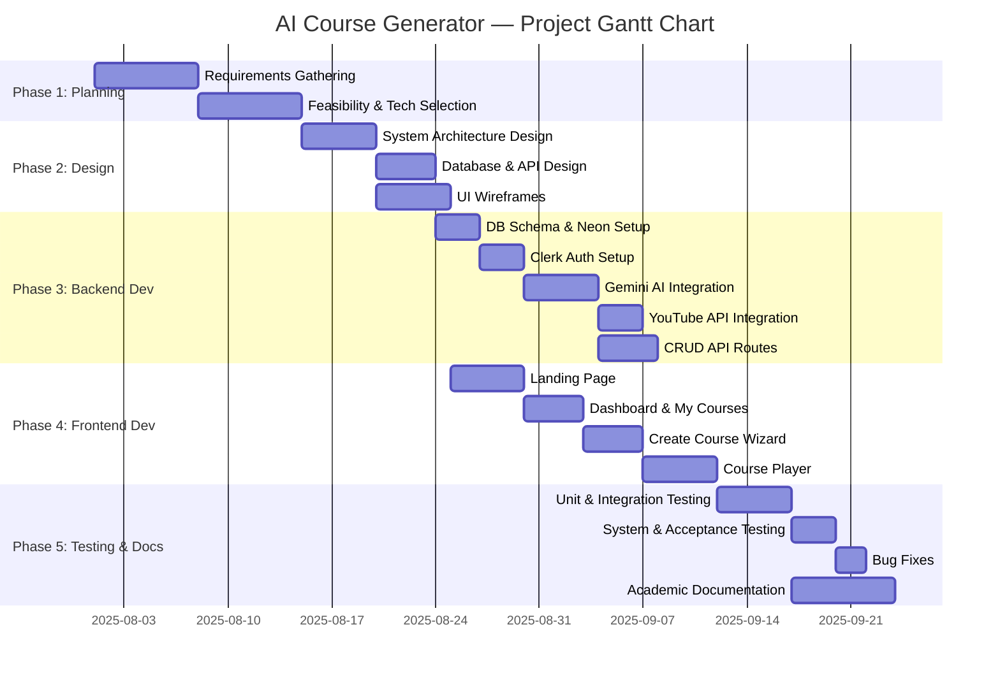
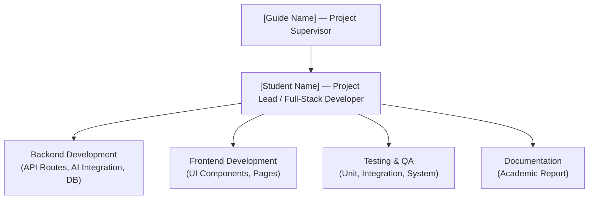
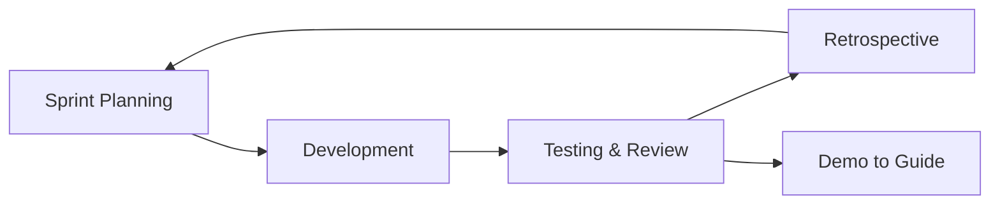

# Chapter 2: Project Planning and Scheduling

---

## 2.1 Project Plan

The development of AI Course Generator was organised into five sequential phases, each with clearly defined objectives, deliverables, and time-boxed durations. The overall project spanned approximately **[N weeks / months]**, commencing on **[Start Date]** and concluding on **[End Date]**.

### Table 2.1 — Project Phases, Milestones, and Deliverables

| Phase | Phase Name | Duration | Key Deliverables | Milestone |
|-------|-----------|----------|-----------------|-----------|
| **1** | Requirements & Planning | 2 weeks | Project scope document, requirements specification, tech stack selection | Requirements freeze |
| **2** | System Design | 2 weeks | ER diagram, system architecture diagram, API contract, UI wireframes | Design approval |
| **3** | Backend Development | 3 weeks | API routes (generate-layout, generate-chapter, CRUD), DB schema, Gemini integration | API functional |
| **4** | Frontend Development | 3 weeks | Landing page, authentication, dashboard, course wizard, course player | UI complete |
| **5** | Integration, Testing & Documentation | 2 weeks | Integration testing, system testing, bug fixes, academic documentation | Submission ready |

**Total Duration:** ~12 weeks (3 months)

---

## 2.2 Work Breakdown Structure

The Work Breakdown Structure (WBS) decomposes the project into manageable task hierarchies across five top-level work packages.

**Figure 2.1 — WBS Diagram**

```mermaid
graph TD
    A["AI Course Generator Project"] --> B["1. Project Management"]
    A --> C["2. Requirements & Analysis"]
    A --> D["3. System Design"]
    A --> E["4. Implementation"]
    A --> F["5. Testing & QA"]
    A --> G["6. Documentation"]

    B --> B1["1.1 Project planning"]
    B --> B2["1.2 Risk management"]
    B --> B3["1.3 Progress tracking"]

    C --> C1["2.1 Requirements gathering"]
    C --> C2["2.2 Feasibility study"]
    C --> C3["2.3 Use case modelling"]

    D --> D1["3.1 System architecture"]
    D --> D2["3.2 Database design"]
    D --> D3["3.3 API design"]
    D --> D4["3.4 UI/UX wireframing"]

    E --> E1["4.1 Database setup (Neon + Drizzle)"]
    E --> E2["4.2 Authentication (Clerk)"]
    E --> E3["4.3 AI integration (Gemini)"]
    E --> E4["4.4 YouTube API integration"]
    E --> E5["4.5 Frontend UI development"]
    E --> E6["4.6 Course player development"]

    F --> F1["5.1 Unit testing"]
    F --> F2["5.2 Integration testing"]
    F --> F3["5.3 System testing"]
    F --> F4["5.4 Acceptance testing"]

    G --> G1["6.1 Source code documentation"]
    G --> G2["6.2 Academic report writing"]
    G --> G3["6.3 Submission packaging"]
```

---

## 2.3 Gantt Chart

The following Gantt chart illustrates the planned schedule for each phase, sub-task, and milestone across the project timeline.

**Figure 2.2 — Gantt Chart**

> **[EDITABLE]** Update `dateFormat` start dates to match your actual project calendar.

---

## 2.4 PERT Chart / CPM

The Programme Evaluation and Review Technique (PERT) is employed to estimate the time required to complete each activity under uncertainty, using the three-point estimation formula:

**Expected Time (tE) = (tO + 4·tM + tP) / 6**

Where:
- **tO** = Optimistic time (minimum if everything goes perfectly)
- **tM** = Most Likely time (realistic estimate)
- **tP** = Pessimistic time (maximum under worst conditions)

### Table 2.3 — PERT Activity Table

| Activity ID | Activity Description | tO (days) | tM (days) | tP (days) | tE (days) |
|-------------|---------------------|-----------|-----------|-----------|-----------|
| A | Requirements Gathering | 3 | 5 | 10 | 5.5 |
| B | System Design | 3 | 6 | 10 | 6.2 |
| C | Database Schema Setup | 1 | 2 | 4 | 2.2 |
| D | Clerk Authentication Integration | 1 | 2 | 5 | 2.3 |
| E | Gemini AI Integration & Prompting | 3 | 5 | 10 | 5.5 |
| F | YouTube API Integration | 1 | 2 | 4 | 2.2 |
| G | CRUD API Routes | 2 | 4 | 7 | 4.2 |
| H | Landing Page UI | 2 | 4 | 7 | 4.2 |
| I | Dashboard & Course Management UI | 2 | 4 | 8 | 4.3 |
| J | Create Course Wizard UI | 2 | 3 | 6 | 3.3 |
| K | Course Player UI | 3 | 5 | 9 | 5.3 |
| L | Unit & Integration Testing | 2 | 4 | 8 | 4.3 |
| M | System & Acceptance Testing | 1 | 3 | 6 | 3.2 |
| N | Documentation & Report Writing | 3 | 6 | 10 | 6.2 |

**Critical Path:** A → B → C → D → E → F → G → K → L → M → N

**Project Duration (CPM):** ~[Sum of critical path activities] days

**Figure 2.3 — PERT Network Diagram**

> *[Insert PERT network diagram showing activity nodes, dependencies, and the critical path highlighted. This may be drawn using draw.io, Lucidchart, or MS Project and inserted as a figure.]*

---

## 2.5 Team Structure and Responsibilities

**Figure 2.5 — Project Team Organisational Chart**

### Table 2.4 — Roles and Responsibilities

| Role | Team Member | Responsibilities |
|------|------------|-----------------|
| **Project Supervisor** | [Guide Name] | Reviews progress, provides technical guidance, approves milestones |
| **Project Lead / Full-Stack Developer** | [Student Name] | Architecture, backend APIs, frontend UI, database design, testing, documentation |
| *(Optional) Frontend Developer* | [Team Member 2 — if applicable] | Landing page, responsive UI, Framer Motion animations |
| *(Optional) Backend Developer* | [Team Member 3 — if applicable] | API route implementation, DB schema, Gemini integration |

> **[EDITABLE]** Adjust roles based on your actual team composition. For a solo project, consolidate all responsibilities under a single developer.

---

## 2.6 Project Development Methodology

### Selected Methodology: Agile with Iterative Sprints

AI Course Generator was developed using an **Agile-inspired iterative methodology**, adapted for a small academic team. The project was divided into weekly sprints, each producing a demonstrable, incremental deliverable. This approach was selected for the following reasons:

1. **Changing requirements:** The generative AI ecosystem is rapidly evolving, necessitating flexibility to incorporate emerging best practices (e.g., Gemini model upgrades, prompt refinements).
2. **Early risk identification:** Each sprint included a testing phase, enabling early detection and resolution of integration issues with third-party APIs (Gemini, YouTube, Clerk).
3. **Incremental delivery:** Working software was available at the end of each sprint, facilitating regular demonstration and feedback from the project guide.

**Figure 2.6 — Agile Sprint Cycle**

### Sprint Summary

| Sprint | Duration | Goal | Output |
|--------|----------|------|--------|
| Sprint 1 | Week 1–2 | Project setup, DB schema, Clerk auth | Auth flow working, DB tables created |
| Sprint 2 | Week 3–4 | Gemini AI integration, generate-layout API | Course layout generation functional |
| Sprint 3 | Week 5–6 | generate-chapter API, YouTube integration | Chapter content + video working |
| Sprint 4 | Week 7–8 | Dashboard, My Courses, Create Course wizard | Frontend CRUD operations complete |
| Sprint 5 | Week 9–10 | Course player, landing page, mobile responsive | Full UI complete |
| Sprint 6 | Week 11–12 | Testing, bug fixes, documentation | Submission-ready project |

---

## 2.7 Hardware and Software Requirements

### Table 2.5 — Hardware Requirements (Development)

| Component | Minimum Specification | Recommended |
|-----------|----------------------|-------------|
| **Processor** | Intel Core i5 (8th Gen) / AMD Ryzen 5 | Intel Core i7 / AMD Ryzen 7 |
| **RAM** | 8 GB | 16 GB |
| **Storage** | 256 GB SSD | 512 GB SSD |
| **Internet Connection** | 10 Mbps broadband | 50 Mbps+ (for API calls) |
| **Display** | 1366 × 768 | 1920 × 1080 |

### Table 2.6 — Hardware Requirements (Production / Deployment)

| Component | Specification |
|-----------|--------------|
| **Cloud Provider** | Vercel (Hobby / Pro tier) |
| **Database** | Neon PostgreSQL (Serverless, Auto-scaling) |
| **CDN** | Vercel Edge Network |
| **Memory (Serverless Functions)** | 1024 MB per function invocation |

### Table 2.7 — Software Requirements (Development Tools)

| Software | Version | Purpose |
|----------|---------|---------|
| **Node.js** | ≥ 18.x LTS | JavaScript runtime |
| **pnpm** | ≥ 8.x | Package manager |
| **Next.js** | 16.1.6 | Full-stack framework |
| **TypeScript** | 5.x | Type-safe development |
| **VS Code** | Latest stable | IDE |
| **Git** | ≥ 2.40 | Version control |
| **Drizzle Kit** | 0.31.x | Database migrations |
| **ESLint** | 9.x | Code linting |
| **Tailwind CSS** | 4.x | Utility-first styling |

### Table 2.8 — Third-Party APIs and Cloud Services

| Service | Provider | Purpose |
|---------|----------|---------|
| **Gemini 2.5 Flash Lite** | Google AI Studio | Course layout and chapter content generation |
| **Clerk** | Clerk.com | User authentication and session management |
| **Neon PostgreSQL** | Neon.tech | Serverless relational database |
| **YouTube Data API v3** | Google Cloud Console | Supplementary video retrieval |
| **Vercel** | Vercel.com | Application hosting and deployment |

---

> **[EDITABLE]** Adjust hardware specs, sprint dates, and team members to match your actual setup and timeline.
