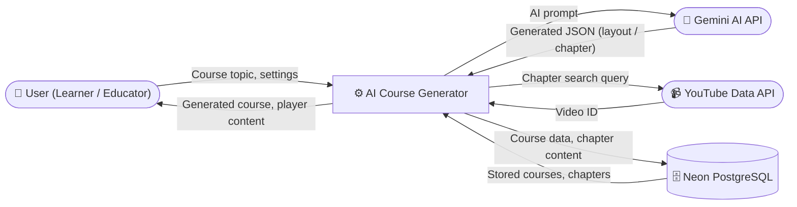
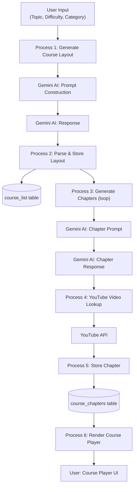
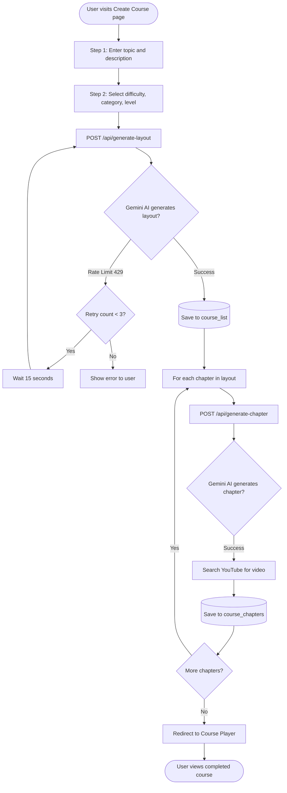
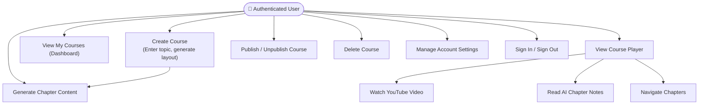
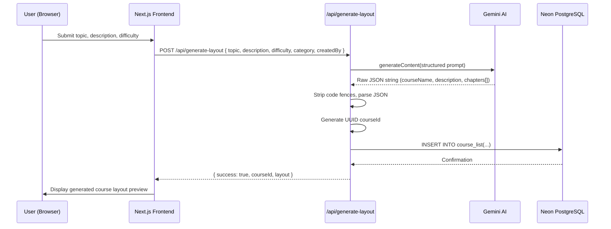
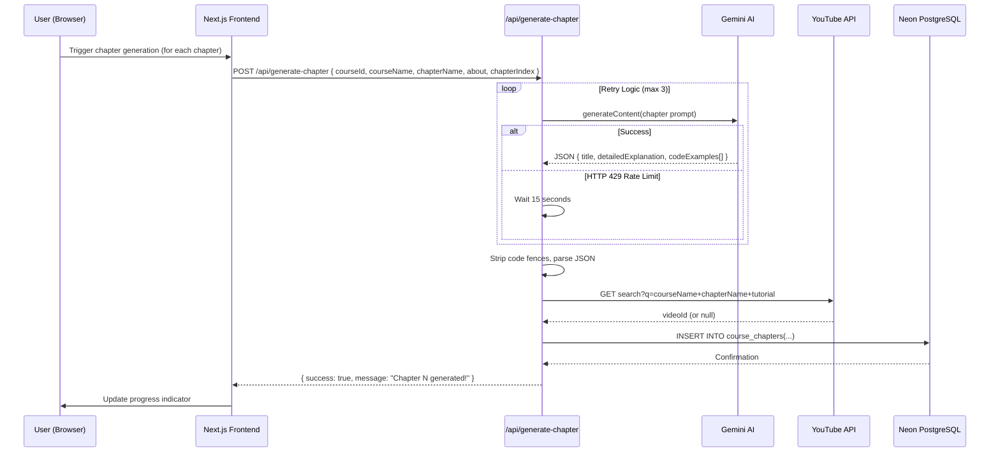
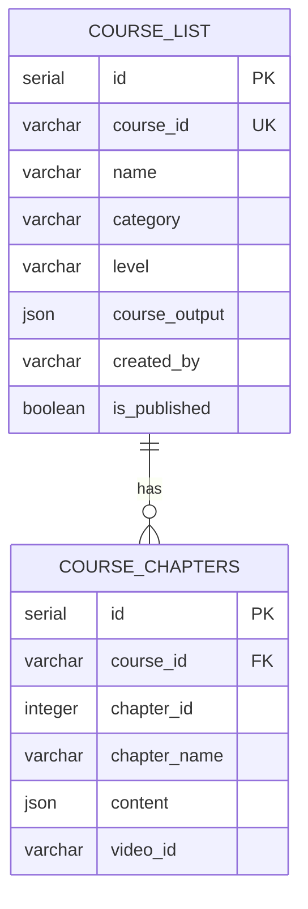

# Chapter 3: System Analysis

---

## 3.1 Problem Description

### 3.1.1 Problem Definition

The creation of professional online courses is a complex, multi-stage process that demands a diverse skill set spanning pedagogical design, subject-matter expertise, content authoring, and multimedia production. Traditional course creation workflows involve:

1. **Curriculum planning** — defining learning objectives, chapter sequencing, and coverage depth.
2. **Content authoring** — writing explanations, creating examples, and sourcing supplementary materials.
3. **Multimedia integration** — identifying and embedding relevant video, audio, or interactive resources.
4. **Platform publishing** — uploading, categorising, and formatting content on a course delivery system.

This multi-step process is estimated to require **40 to 200 hours of effort** per course, depending on length and domain complexity [*Reference*]. For independent educators, small institutions, and organisations with constrained resources, this effort represents a prohibitive barrier to entry.

#### Identified Gaps in Existing Systems

| Problem | Description |
|---------|-------------|
| **High creation barrier** | Manual course authoring requires specialist skills in instructional design, content writing, and video production |
| **No automation layer** | Existing platforms (Udemy, Coursera Studio, Teachable) provide infrastructure but no content generation assistance |
| **Poor content personalisation** | Most platforms offer templates but not adaptive, topic-specific content structures |
| **Lack of AI integration** | Current EdTech tools do not leverage LLMs for automated curriculum design |
| **Video discovery is manual** | Educators must manually search for and embed relevant tutorial videos |
| **High time-to-market** | Building a structured course from scratch takes weeks to months |

---

### 3.1.2 Proposed Solution

The proposed solution — **AI Course Generator** — addresses the identified gaps by introducing an AI-powered automation layer into the course creation lifecycle. The system's key innovations are:

1. **LLM-driven syllabus generation:** The Google Gemini 2.5 Flash Lite model generates a complete, structured course syllabus from a simple topic input, including chapter names, descriptions, and estimated durations.

2. **LLM-driven chapter content generation:** For each chapter in the generated syllabus, the system automatically produces detailed educational explanations, markdown-formatted notes, and relevant code examples.

3. **Automated video augmentation:** The YouTube Data API v3 is queried with chapter-specific search terms to surface the most relevant tutorial video, which is automatically embedded in the course player.

4. **Seamless user experience:** The entire workflow — from topic input to navigable course — is completed within a single, intuitive web interface without requiring any technical knowledge from the user.

### Table 3.1 — Existing System vs. Proposed System

| Dimension | Existing System (Manual) | Proposed System (AI Course Generator) |
|-----------|--------------------------|---------------------------------------|
| Course creation time | 40–200 hours | < 5 minutes |
| Pedagogical expertise required | High | None |
| Content quality | Variable | Consistent, AI-guided |
| Video integration | Manual | Automatic (YouTube API) |
| Technical barrier | Medium–High | Low (web-based form) |
| Scalability | Low (human-dependent) | High (API-driven, serverless) |
| Cost | High (human hours) | Low (API consumption pricing) |

---

## 3.2 Requirements

### 3.2.1 Functional Requirements

#### Table 3.2 — Functional Requirements: User Management Module

| ID | Requirement | Priority |
|----|-------------|----------|
| FR-01 | The system shall allow users to register using email/password or OAuth providers (Google, GitHub) via Clerk | Must Have |
| FR-02 | The system shall authenticate users and maintain secure sessions using Clerk JWT tokens | Must Have |
| FR-03 | The system shall restrict course creation, management, and player features to authenticated users | Must Have |
| FR-04 | The system shall display the user's name and avatar in the dashboard header | Should Have |
| FR-05 | The system shall allow users to access account settings via a settings page | Should Have |

#### Table 3.3 — Functional Requirements: Course Generation Module

| ID | Requirement | Priority |
|----|-------------|----------|
| FR-06 | The system shall accept a topic, description, difficulty level, and category as inputs for course creation | Must Have |
| FR-07 | The system shall generate a structured course layout (courseName, description, chapters[]) using the Gemini AI API | Must Have |
| FR-08 | The system shall persist the generated course layout in the `course_list` database table | Must Have |
| FR-09 | The system shall generate detailed chapter content (title, detailedExplanation, codeExamples[]) for each chapter | Must Have |
| FR-10 | The system shall implement a retry mechanism (max 3 retries with 15-second delay) for Gemini API rate-limit errors | Must Have |
| FR-11 | The system shall search the YouTube Data API for a relevant tutorial video for each chapter | Should Have |
| FR-12 | The system shall persist chapter content and associated video IDs in the `course_chapters` table | Must Have |

#### Table 3.4 — Functional Requirements: Course Management Module

| ID | Requirement | Priority |
|----|-------------|----------|
| FR-13 | The system shall display all courses created by the authenticated user on the dashboard | Must Have |
| FR-14 | The system shall allow users to publish or unpublish a course (toggle `is_published` flag) | Must Have |
| FR-15 | The system shall allow users to delete a course and all associated chapter data | Must Have |
| FR-16 | The system shall display the course name, category, level, and published status on dashboard cards | Should Have |

#### Table 3.5 — Functional Requirements: Course Player Module

| ID | Requirement | Priority |
|----|-------------|----------|
| FR-17 | The system shall render an embedded YouTube video player for the active chapter | Must Have |
| FR-18 | The system shall display AI-generated chapter explanations beneath the video player | Must Have |
| FR-19 | The system shall render code examples in syntax-highlighted, language-labelled code blocks | Must Have |
| FR-20 | The system shall provide a navigable chapter sidebar listing all course chapters with durations | Must Have |
| FR-21 | The system shall auto-close the chapter sidebar on mobile devices after a chapter is selected | Should Have |
| FR-22 | The system shall provide a back-navigation link to return to the user dashboard | Should Have |

---

### 3.2.2 Non-Functional Requirements

#### Table 3.6 — Non-Functional Requirements

| ID | Category | Requirement |
|----|----------|-------------|
| NFR-01 | **Performance** | Course layout generation API response time shall not exceed 10 seconds under normal load |
| NFR-02 | **Performance** | Chapter content generation shall complete within 30 seconds per chapter (excluding Gemini rate-limit retries) |
| NFR-03 | **Scalability** | The system shall support concurrent requests from at least 100 simultaneous users using serverless infrastructure |
| NFR-04 | **Security** | All API routes shall be protected by Clerk session validation; unauthenticated requests shall return HTTP 401 |
| NFR-05 | **Security** | API keys (Gemini, YouTube, Clerk secret) shall be stored exclusively in server-side environment variables |
| NFR-06 | **Reliability** | The system shall implement automatic retry logic to achieve at least 95% success rate for AI generation requests despite transient rate-limit errors |
| NFR-07 | **Usability** | The course creation workflow shall be completable in fewer than 5 user interactions from dashboard to generated course |
| NFR-08 | **Accessibility** | The interface shall achieve a minimum Lighthouse accessibility score of 80 on all major pages |
| NFR-09 | **Maintainability** | All database schema changes shall be managed through Drizzle ORM migrations to ensure reproducibility |
| NFR-10 | **Compatibility** | The application shall function correctly on the latest versions of Chrome, Firefox, Safari, and Edge |
| NFR-11 | **Responsiveness** | The UI shall be fully usable on devices with screen widths from 320px (mobile) to 2560px (ultra-wide) |

---

## 3.3 Problem Analysis Diagrams

### 3.3.1 Data Flow Diagram / Process Flow Diagram

#### Level 0 DFD — Context Diagram

**Figure 3.1 — Level 0 DFD (Context Diagram)**

#### Level 1 DFD — Course Generation Process

**Figure 3.2 — Level 1 DFD**

#### Process Flow Diagram — Course Creation Workflow

**Figure 3.4 — Course Creation Process Flow**

---

### 3.3.2 Use Case Diagram and Sequence Diagram

#### Use Case Diagram — Authenticated User

**Figure 3.5 — Use Case Diagram**

#### Sequence Diagram — Course Layout Generation

**Figure 3.7 — Sequence Diagram: Course Layout Generation**

#### Sequence Diagram — Chapter Content Generation

**Figure 3.8 — Sequence Diagram: Chapter Generation**

---

## 3.4 Database Schema

The system employs a relational PostgreSQL schema managed by Drizzle ORM and hosted on Neon. The schema consists of two primary tables.

### Table 3.8 — `course_list` Table Schema

| Column Name | Data Type | Constraints | Description |
|-------------|-----------|-------------|-------------|
| `id` | `SERIAL` | PRIMARY KEY | Auto-incrementing internal row ID |
| `course_id` | `VARCHAR` | NOT NULL, UNIQUE | UUID generated at course creation |
| `name` | `VARCHAR` | NOT NULL | AI-generated course name |
| `category` | `VARCHAR` | NOT NULL | User-supplied category (e.g., "Programming") |
| `level` | `VARCHAR` | NOT NULL | Difficulty level (e.g., "Beginner", "Advanced") |
| `course_output` | `JSON` | NOT NULL | Full AI-generated syllabus JSON (courseName, description, chapters[]) |
| `created_by` | `VARCHAR` | NOT NULL | Clerk user ID or email of the course creator |
| `is_published` | `BOOLEAN` | NOT NULL, DEFAULT false | Publication status flag |

### Table 3.9 — `course_chapters` Table Schema

| Column Name | Data Type | Constraints | Description |
|-------------|-----------|-------------|-------------|
| `id` | `SERIAL` | PRIMARY KEY | Auto-incrementing internal row ID |
| `course_id` | `VARCHAR` | NOT NULL | Foreign key reference to `course_list.course_id` |
| `chapter_id` | `INTEGER` | NOT NULL | Zero-based index of the chapter within the course |
| `chapter_name` | `VARCHAR` | NOT NULL | Name of the chapter |
| `content` | `JSON` | NOT NULL | AI-generated content JSON (title, detailedExplanation, codeExamples[]) |
| `video_id` | `VARCHAR` | NOT NULL | YouTube video ID (empty string if unavailable) |

**Figure 3.9 — ER Diagram**

---

> **[EDITABLE]** Functional requirement IDs and non-functional requirements can be expanded if additional features are implemented. Update DFD page number references once the report is assembled.
