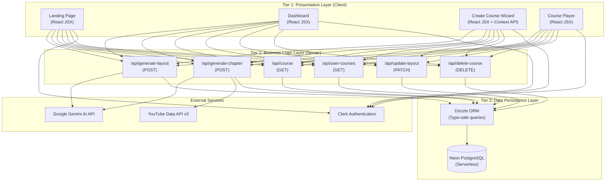
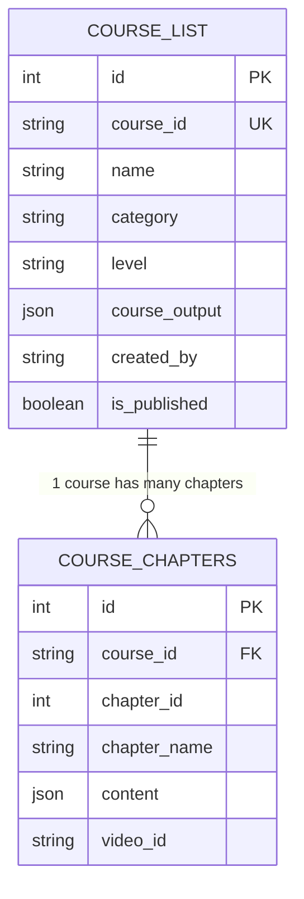
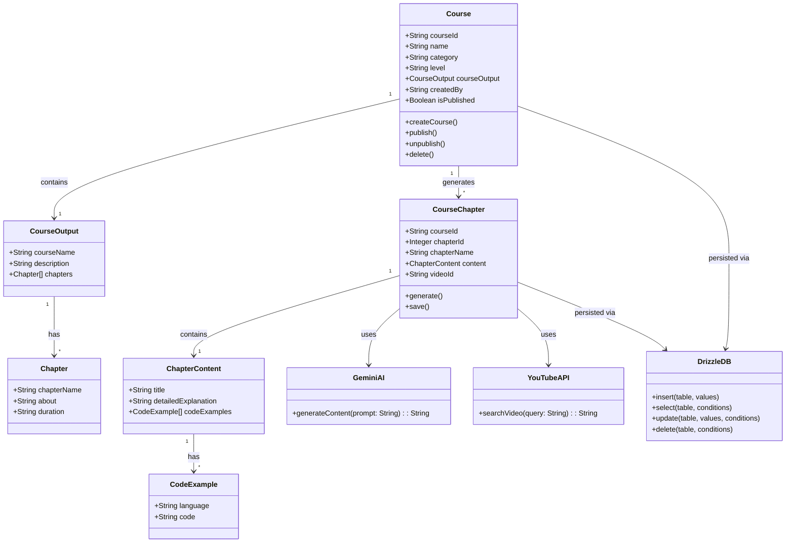
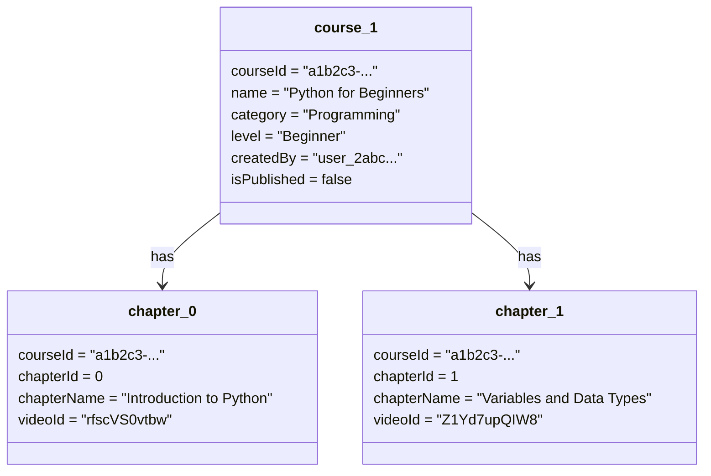

# Chapter 4: System Design

---

## 4.1 System Architecture

AI Course Generator is built upon a **three-tier client-server architecture** implemented within the Next.js 16 App Router paradigm. This architecture cleanly separates concerns across the presentation, business logic, and data persistence layers, enabling independent scaling, testing, and evolution of each tier.

### Figure 4.1 — Three-Tier System Architecture



### Table 4.1 — Architecture Layers and Technologies

| Tier | Layer | Technology | Role |
|------|-------|-----------|------|
| 1 | **Presentation** | Next.js 16, React 19, Tailwind CSS v4, Framer Motion | User interface, client-side state, routing |
| 2 | **Business Logic** | Next.js API Routes (Edge/Node.js runtime) | REST API endpoints, AI prompt orchestration, retry logic |
| 3 | **Data Persistence** | Neon PostgreSQL + Drizzle ORM | Relational data storage, type-safe query building |
| — | **Authentication** | Clerk | Identity management, session validation, OAuth |
| — | **AI Engine** | Google Gemini 2.5 Flash Lite | LLM-based content generation |
| — | **Video Service** | YouTube Data API v3 | Chapter video discovery |

---

## 4.2 Physical Design

### 4.2.1 Structure Chart

#### Figure 4.3 — Top-Level Module Structure Chart

```
AI Course Generator
├── [M0] Application Root (Next.js App Router)
│   ├── [M1] Authentication Module (Clerk)
│   │   ├── [M1.1] Sign-In Page
│   │   └── [M1.2] Sign-Up Page
│   ├── [M2] Landing Page Module
│   │   ├── [M2.1] Header Component
│   │   ├── [M2.2] Hero Component
│   │   ├── [M2.3] Features Component
│   │   ├── [M2.4] How It Works Component
│   │   ├── [M2.5] Testimonials Component
│   │   ├── [M2.6] Pricing Component
│   │   └── [M2.7] Footer Component
│   ├── [M3] Dashboard Module
│   │   ├── [M3.1] Dashboard Overview Page
│   │   ├── [M3.2] My Courses Page
│   │   │   └── [M3.2.1] Course Card Component
│   │   ├── [M3.3] Create Course Module
│   │   │   ├── [M3.3.1] Step 1: Topic & Description (CreateCourse)
│   │   │   └── [M3.3.2] Step 2: Options & Settings (Options)
│   │   ├── [M3.4] Settings Page
│   │   └── [M3.5] Upgrade Page
│   ├── [M4] Course Player Module
│   │   ├── [M4.1] Video Player (YouTube iframe)
│   │   ├── [M4.2] Chapter Content Renderer
│   │   │   ├── [M4.2.1] Explanation Display
│   │   │   └── [M4.2.2] Code Examples Block
│   │   └── [M4.3] Chapter Sidebar Navigator
│   └── [M5] API Layer
│       ├── [M5.1] generate-layout (POST)
│       ├── [M5.2] generate-chapter (POST)
│       ├── [M5.3] course (GET)
│       ├── [M5.4] user-courses (GET)
│       ├── [M5.5] update-layout (PATCH)
│       └── [M5.6] delete-course (DELETE)
```

### Table 4.2 — API Endpoints Summary

| Method | Endpoint | Description | Auth Required |
|--------|----------|-------------|--------------|
| `POST` | `/api/generate-layout` | Generate AI course layout and save to DB | Yes |
| `POST` | `/api/generate-chapter` | Generate AI chapter content + YouTube video | Yes |
| `GET` | `/api/course?courseId=...` | Fetch course and all its chapters by courseId | Yes |
| `GET` | `/api/user-courses?createdBy=...` | Fetch all courses for a specific user | Yes |
| `PATCH` | `/api/update-layout` | Toggle course `is_published` status | Yes |
| `DELETE` | `/api/delete-course?courseId=...` | Delete a course and all chapters | Yes |

---

### 4.2.2 ER Diagram

**Figure 4.5 — Entity-Relationship Diagram**



**Relationship:** One `COURSE_LIST` record corresponds to zero or more `COURSE_CHAPTERS` records via the `course_id` foreign key. A course may exist without generated chapters (draft state), and chapters are deleted when their parent course is deleted.

---

### 4.2.3 Class Diagram and Object Diagram

#### Figure 4.6 — UML Class Diagram



#### Figure 4.7 — UML Object Diagram (Sample Course Instance)



---

## 4.3 Input and Output Design

### Input Design

#### Figure 4.8 — Course Creation Form — Step 1

The first step of the course creation wizard collects the following inputs:

### Table 4.3 — Input Field Specifications (Course Creation)

| Field | Type | Validation | Description |
|-------|------|-----------|-------------|
| **Topic** | Text input | Required, min 3 chars | The subject of the course (e.g., "Machine Learning") |
| **Description** | Textarea | Required, min 10 chars | A brief overview of what the course should cover |
| **Category** | Dropdown / Text | Required | Subject category (e.g., Programming, Data Science, Design) |
| **Difficulty Level** | Select / Radio | Required | Beginner / Intermediate / Advanced |

The second step allows configuration of generation options including the number of chapters and desired language of instruction (placeholder for future versions).

---

### Output Design

The system produces outputs at two levels:

#### Table 4.4 — Output Specification: AI Course Layout JSON

```json
{
  "courseName": "String — AI-generated course title",
  "description": "String — Brief course overview",
  "chapters": [
    {
      "chapterName": "String — Chapter title",
      "about": "String — Description of chapter content",
      "duration": "String — Estimated time (e.g., '2 Hours')"
    }
  ]
}
```

#### Table 4.5 — Output Specification: AI Chapter Content JSON

```json
{
  "title": "String — Chapter title",
  "detailedExplanation": "String — Multi-paragraph markdown-formatted educational content",
  "codeExamples": [
    {
      "language": "String — Programming language (e.g., 'python', 'javascript', 'none')",
      "code": "String — Actual code block or example text"
    }
  ]
}
```

The **Course Player** renders these outputs as:
- An embedded YouTube `<iframe>` video player (top of page)
- A rendered text section for `detailedExplanation`
- Syntax-highlighted `<pre><code>` blocks for each item in `codeExamples`

---

## 4.4 Algorithmic Design

This section presents the high-level algorithmic logic for the two core AI generation processes. Full pseudocode is provided in the List of Algorithms (Chapter 10).

### Course Layout Generation Algorithm (Summary)

1. Accept user input (topic, description, difficulty, category, user ID)
2. Construct a structured prompt instructing Gemini to produce a raw JSON syllabus
3. Invoke `GenerateCourseLayout_AI.generateContent(prompt)`
4. Strip any incidental markdown code fences from the response
5. Parse response into a JavaScript object (`courseLayoutJson`)
6. Generate a UUID for the new course (`courseId`)
7. Insert a new record into `course_list` with `isPublished = false`
8. Return `{ courseId, layout }` to the client

### Chapter Content Generation Algorithm (Summary — with Retry Logic)

1. Accept `courseId`, `courseName`, `chapterName`, `about`, `chapterIndex`
2. Construct an educator-role prompt instructing Gemini to produce a raw JSON chapter object
3. Invoke `GenerateChapterContent_AI.generateContent(prompt)` within a retry loop (max 3 attempts)
   - On HTTP 429 (rate limit): wait 15 seconds and retry
   - On any other error: throw immediately
4. Strip code fences and parse the response JSON
5. Invoke `searchYouTube(courseName + " " + chapterName + " tutorial")` to retrieve a video ID
6. Insert a new record into `course_chapters` with `content` and `videoId`
7. Return `{ success: true }` to the client

---

> **[EDITABLE]** Diagrams marked with *"Insert figure here"* should be replaced with hand-drawn or tool-generated equivalents (draw.io, Lucidchart, Figma) and inserted as images in the printed report.
